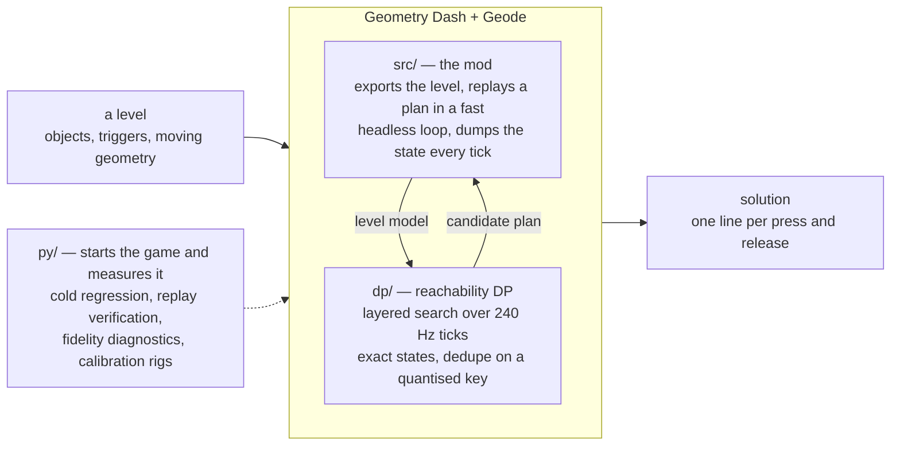
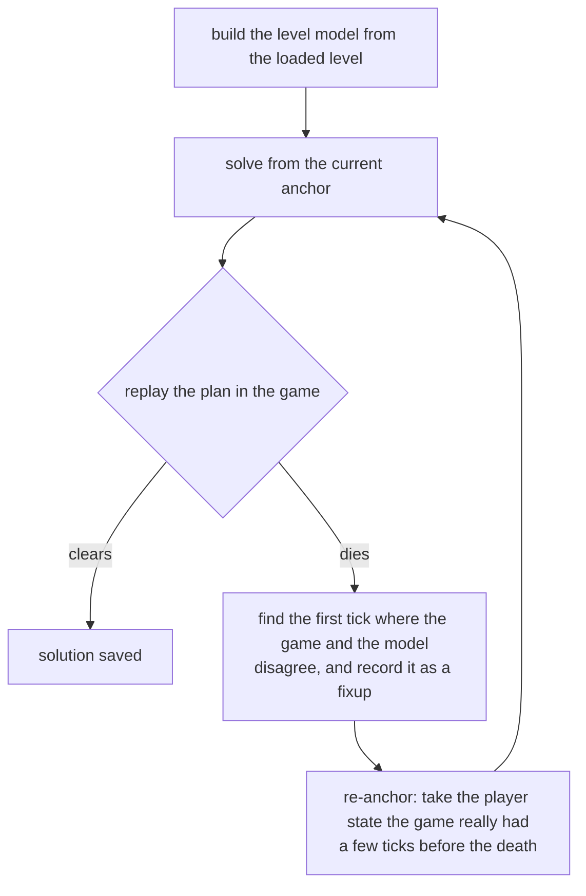

# gdsolver

**An automatic TAS solver for Geometry Dash** (2.2081, Windows / Steam). It
solves a level by playing it — inside the game, from cold.

<p align="center">
  
</p>

<p align="center"><sub>
  The last five seconds of solving <b>Dash</b>, then the first seven of the
  replay. The overlay is the loop's own: which round it is on, how far the best
  plan has reached, how far the search has got. The screen is dark because the
  search is running — the frames go to the fast loop instead — and it comes back
  when a candidate has actually cleared.
</sub></p>

Give it a level and it finds an input sequence that clears it. It does not
re-implement the game's physics: an approximate, measured-where-it-matters model
drives a **reachability DP** (which `(y, velocity)` states are reachable at every
physics tick), and the game itself — running inside a **Geode mod** — is the
verifier that decides whether a candidate plan really clears. Where the replay
diverges from the model, the solver re-anchors on the game's own state and
continues from there; where the model cannot get through a stretch at all, it
searches the game itself there.

**All 22 official levels, and the 17 levels of the spin-off games, are solved
cold** — no seeds, no previous solutions, no external ground truth — by the loop
inside the game, with nothing installed but Geometry Dash, Geode and this mod.
Press a level's play button, pick **Solve** in the menu that opens, and it builds
the level, searches, replays the candidate, and repairs the plan wherever the
game disagrees with it; no external process is involved. Most levels take under
a minute. The solutions of the 22 are tracked in [`data/`](data/) as
`solution_lv<N>_dp.txt`, one `input=<tick>,<0|1>` line per press or release.

**With every coin, too.** Switch **Coins** on in that menu and the goal becomes
the end of the level *and* every coin in it. The 22 official levels and the six
spin-off levels that have coins (Meltdown's three and SubZero's three) are solved
that way as well, cold, and each of those solutions replays to a clear with every
coin counted by the game itself; the 22 are tracked beside the others as
`solution_lv<N>_coins.txt`. Coins picked up while the mod drives are never
awarded (see [Safety](#safety--community-notes)) — a coin route is a TAS result,
not progress on a save file.

Those levels are also the supported set — see [What's next](#whats-next) for
where custom levels and platformer mode stand.

## Results

The tables are cold regression runs of the v0.3.0 build (2026-09-27; v0.3.1
builds to the same code, see the [changelog](changelog.md)) —
`python py/cold_regress.py --one-session`, the whole suite inside a single game
session, no plan and no solution file to start from — one with coins
(`--cfg coinroute=1 coins=1`) and one for the end of the level alone. The coin
runs ended every level with every coin, as the game itself counted them. The
same runs are the regression baseline.

Every cell reads **with every coin**, then in brackets **the end of the level
alone**.

| # | Level | Repairs | Time | | # | Level | Repairs | Time |
|--:|---|--:|--:|---|--:|---|--:|--:|
| 1 | Stereo Madness | 1 (0) | 6 s (4 s) | | 12 | Theory of Everything | 0 (0) | 6 s (5 s) |
| 2 | Back On Track | 0 (0) | 3 s (4 s) | | 13 | Electroman Adventures | 0 (1) | 5 s (6 s) |
| 3 | Polargeist | 0 (0) | 4 s (4 s) | | 14 | Clubstep | 0 (0) | 6 s (24 s) |
| 4 | Dry Out | 0 (0) | 4 s (3 s) | | 15 | Electrodynamix | 2 (1) | 13 s (8 s) |
| 5 | Base After Base | 0 (0) | 4 s (4 s) | | 16 | Hexagon Force | 4 (15) | 54 s (1 m 26 s) |
| 6 | Can't Let Go | 0 (0) | 4 s (4 s) | | 17 | Blast Processing | 4 (1) | 13 s (7 s) |
| 7 | Jumper | 0 (0) | 4 s (4 s) | | 18 | Theory of Everything 2 | 8 (3) | 23 s (16 s) |
| 8 | Time Machine | 0 (3) | 5 s (8 s) | | 19 | Geometrical Dominator | 4 (5) | 38 s (1 m 5 s) |
| 9 | Cycles | 0 (0) | 5 s (4 s) | | 20 | Deadlocked | 22 (14) | 1 m 51 s (1 m 18 s) |
| 10 | xStep | 1 (1) | 6 s (5 s) | | 21 | Fingerdash | 12 (23) | 2 m 24 s (3 m 17 s) |
| 11 | Clutterfunk | 5 (1) | 38 s (9 s) | | 22 | Dash | 39 (26) | 12 m 5 s (2 m 55 s) |

The two numbers in a cell are two separate searches, not a total and a part:
with coins the goal is a different one, so the search takes a different route
from the first round on, and it is not always the longer one.

Against `v0.2.0` the counts moved on most of the later levels. The large moves:
Hexagon Force 38 → 15 without coins, where a section solve now crosses the wall
the repairs used to grind at, and 17 → 4 with them; Geometrical Dominator 15 → 4 and
Dash 56 → 39 with coins; and Fingerdash 5 → 12 with coins and 8 → 23 without.
Fingerdash's rise comes from one of the coin changes — a shallower replay's
recording of the moving geometry now replaces one that is out of phase with it
(cfg `groupsretime`); without coins and with that switched off, it takes 9
rounds again.

### The spin-off levels

The official levels of Meltdown, World and SubZero, and The Challenge, run the
same way, one game session per set. World's levels and The Challenge have no
coins, so they have one number. These levels are not in the main game's level
list; the suite reads them from level files (cfg `leveldir=<dir>`, one
`<id>.lvl` per level), which are not distributed here.

| Game | # | Level | Repairs | Time |
|---|--:|---|--:|--:|
| Meltdown | 1001 | The Seven Seas | 7 (5) | 19 s (15 s) |
| Meltdown | 1002 | Viking Arena | 2 (5) | 12 s (18 s) |
| Meltdown | 1003 | Airborne Robots | 1 (1) | 12 s (13 s) |
| World | 2001 | Payload | 0 | 3 s |
| World | 2002 | Beast Mode | 0 | 4 s |
| World | 2003 | Machina | 0 | 2 s |
| World | 2004 | Years | 0 | 6 s |
| World | 2005 | Frontlines | 0 | 5 s |
| World | 2006 | Space Pirates | 0 | 6 s |
| World | 2007 | Striker | 1 | 4 s |
| World | 2008 | Embers | 3 | 3 s |
| World | 2009 | Round 1 | 0 | 4 s |
| World | 2010 | Monster Dance Off | 0 | 4 s |
| — | 3001 | The Challenge | 6 | 6 s |
| SubZero | 4001 | Press Start | 33 (29) | 4 m 57 s (1 m 15 s) |
| SubZero | 4002 | Nock Em | 56 (26) | 15 m 27 s (2 m 10 s) |
| SubZero | 4003 | Power Trip | 103 (41) | 10 m 49 s (1 m 57 s) |

**Repairs** is how many times the loop had to go back: solve, replay, die,
re-anchor on the game's real state, solve the tail. `0` means the very first
plan the DP produced cleared the level. For a given build the count is
normally reproducible, and `py/cold_regress.py` compares the `[fp]` line each
round prints against `data/cold_baseline.json` (`data/cold_baseline_coins.json`
for a coin run); a change is reported, not failed. The spin-off levels have
baselines of their own, kept with their level files. The one level known to vary
from run to run is SubZero 4003 with coins: its section searches can take a
different route each time (102 to 106 rounds over three runs of this build, all
clearing with every coin).

It is not a fidelity score. It counts what the loop had to do, and that depends
on which corridor the search happens to walk as much as on where the model is
wrong — the search is deepest-first, so touching one rule reorders the frontier
and the run takes a different route. Making the model *more* correct can raise
it: closing a route the model only believed in sends the search off to find the
real one.

**Time** comes from those same runs — 8 solver threads on a 16-core desktop — and
it counts everything from the level being built to the solution being written
(the game's own start-up is not in it);
the 22 add up to the 20 minutes the coin suite took (12 without coins). Each
suite ran alone on the machine, but read the clock as a guide and not as a
contract: it is not what the regression compares, and a level's time is read
from outside the game about once a second.

Almost all of it is the search. Broken down on the 2026-08-27 run, before the
section solver joined the loop, the DP calls were 86 % of the total and 88–93 % on
the four expensive levels; on the ones that finish inside half a minute, most of
what is left is starting the game and loading the level. On a level where section solves run (Dash
with coins, SubZero) a good part of the time is now spent searching inside the
game instead; how large a part has not been measured.

## How it works



Geometry Dash gives the player no steering input: the level sets the forward speed,
so the only decision per physics tick is *pressed or not*. Clearing a level is
then a reachability question over `(tick, y, vy, mode, gravity, size, ...)`, and
two properties make the game usable as the oracle for it: the physics are
deterministic under *click on steps*, and x is essentially a clock, so re-anchoring
the search on a later tick costs nothing. (*Essentially*, because stair snapping
leaves a sub-pixel phase and a rotation section turns the frame — see
[docs/ARCHITECTURE.md](docs/ARCHITECTURE.md#1-the-problem).) That is the whole loop:



A *fixup* is the model agreeing to be wrong: from then on, whenever it meets
that same state again it applies the game's result instead of its own. Dead
bands, touch triggers that must be entered, ladders of anchor depths and
phantom-death detection exist for the other cases where the model is blind.
Every run is cold, and a run's fixups live only in that run.

How far each solve looks ahead follows the game's last verdict: while replays keep
dying soon after their anchor, the loop plans 3,000 ticks at a time and lets the
game check each step; once a plan outlives its step, it plans the rest of the
level. And a repair does not have to solve everything past the death again: when
the new search comes back onto the trajectory of the plan that died, it stops
there and keeps that plan's inputs from that point on.

Around that loop:

* **Section solving.** Where the repairs are not getting the plan across a wall,
  the loop replays to a practice checkpoint before it, searches the game itself
  from there, and splices back what the game reproduces —
  [docs/SECTION_SOLVE.md](docs/SECTION_SOLVE.md).
* **Coins.** With coins on, the collected set is part of the search state and a
  state that leaves a coin behind is dead; nothing steers the search towards a
  coin, the goal simply is not reached without it. Coins that wait for an item
  counter, a key or a switch are routed through what turns them on —
  [docs/COINS.md](docs/COINS.md).
* **Heavy levels** are solved on a copy without the objects the run cannot depend
  on, and every plan is verified on the level itself before it is filed —
  [docs/LEVEL_SLICE.md](docs/LEVEL_SLICE.md).
* **Moving geometry** is the game's own recording of each replay, joined at the
  tick the last replay died to a recording of the level played with no input.
  An Area Move whose distance the game draws from random seeds it never resets
  lands somewhere else on every attempt, so the model treats the whole box it can
  land in as deadly while the object is solid, so the model's plans do not depend
  on the seeds (Area Rotate and Area Scale with a variance, and an Advanced
  Follow's, are not covered yet; the `areaenv:` line counts them).

* **`dp/`** — the solver core (`leveldp`, also linked into the mod). States are
  *exact*; the per-layer hash only deduplicates and never snaps a state, so every
  surviving path is a replayable plan. The DP is a candidate generator — the
  proof is always a plain replay in the game. Its physics rules are measured
  against the game (calibration levels, traces, disassembly), not fitted.
* **`src/`** — the Geode mod: level export, input injection, the per-tick state
  dump, moving-geometry recording, the fast headless loop, and the repair loop
  itself (`src/mod/repair.hpp`). It also blocks achievements and statistics
  while it is driving.
* **`py/`** — development tools; nothing here solves. The cold regression over
  all levels (`cold_regress.py`) and the manifest that says what a run measured
  (`cold_manifest.py`), replay verification, fidelity diagnostics,
  calibration-level generation and tests, and an MCP server for probing the
  running game.

[`docs/ARCHITECTURE.md`](docs/ARCHITECTURE.md) has the long version.

## What's next

**Custom levels — unsupported today, partial support planned.** Nothing in the
loop is specific to the official levels, any level can be picked, and plenty of
custom levels already solve as they are: in a random sample of rated levels built
with 1.7-era parts, 71 of 78 cleared cold (measured the week before this release,
which may change that). They are nonetheless **not supported**:
the regression covers the official levels only, so nothing is keeping them honest,
and a level that leans on a mechanic the model has never been measured against is
one it is wrong about — which costs rounds, and how often a newer level gets
through has not been measured yet. [docs/CUSTOM_LEVELS.md](docs/CUSTOM_LEVELS.md) says which levels
usually solve, which gimmicks the model does not cover, and what a failure looks
like. The rule is to clear what the game lets the loop clear: where the model has
no answer, the section solver searches the game itself, and a plan the game clears
is a solution however it was found. The work is to say plainly which levels the
model covers — fast and predictable, kept so by the regression — and which clear
only with the section solver's help, and to tell the player up front when a level
uses something the model does not have.

**Platformer levels are outside the formulation, not merely unmeasured.** The
search rests on there being no steering input; a platformer level hands the player
one, so forward position stops being driven by the level and the decision each
tick stops being one bit. No measurement closes that — it is a different search
problem, and the section solver, which also chooses one bit per tick, cannot
search it either. So the mod refuses one instead of trying: it reads both the
layer's flag and the level's own, and takes the refusal if the two ever disagree.
Safety is unaffected either way — the record gate asks whether an automated session is open, never which
mode is running.

## Installing

Grab **[`gdsolver.solver.geode` from the latest release](https://github.com/gdsolver/gdsolver/releases/latest)**
and drop it into Geometry Dash's `geode/mods/` folder, then start the game — the
usual place is

```
C:\Program Files (x86)\Steam\steamapps\common\Geometry Dash\geode\mods\
```

Geode itself has to be installed first ([geode-sdk.org](https://geode-sdk.org)).
The build is for **Windows and GD 2.2081**; Geode refuses to load it on anything
else rather than misbehaving. Nothing else is needed — no Python, no external
process, no second copy of the game.

The mod announces itself in the log the moment it loads, and says what it
suppresses:

```
gdsolver: loaded. While the bot drives -- solving or replaying -- achievements,
statistics, coins and the level's own record are all blocked. Your own attempts,
with the bot idle, record as usual.
```

Installing it does **not** cost you your progress: the block is tied to an
automated session being open, not to the mod being present. See
[Safety](#safety--community-notes).

## Building

Requirements: Visual Studio 2022 (C++ desktop workload), CMake ≥ 3.21, the
[Geode SDK](https://geode-sdk.org) (`GEODE_SDK` environment variable) and
Geode CLI for the mod.

```powershell
# solver CLI only (no Geode needed)
cmake -S . -B build-dp -DGDSOLVER_BUILD_MOD=OFF
cmake --build build-dp --config Release        # -> build-dp/dp/Release/leveldp.exe

# mod + CLI
geode build                                    # -> build/gdsolver.solver.geode
```

## Watching a run

A level's play button opens a menu offering three modes: **Normal**, **Replay** (play a stored
solution) and **Solve** (solve the level in-process), and a **Coins** switch: with it on, Solve
routes through every coin and files the result as `solution_lv<N>_coins.txt`, and Replay plays
that file and reports the coins the game counted.
A solve runs
fast, dark and silent until a candidate clears, and then plays that one through at 1x with the
artwork and the music. While a level is on screen an overlay reports what the loop is doing, and
F10 draws the iteration map: where the repair rounds went, and where the model — rather than
the plan — was wrong. Leaving a level ends its solve.

The overlay has no key that lets a player do what the game does not allow: no warp, no noclip,
no forced mode, no infinite jump. It is for watching a run, not for changing one.

[docs/RUNNING.md](docs/RUNNING.md) has the play menu, the overlay, the full key table and the seek
bar; [docs/ITERMAP.md](docs/ITERMAP.md) has what the map's marks mean.

## Safety / community notes

This is a TAS and research tool, not a way to fake records.

* **While the mod is driving — solving or replaying — nothing is recorded**:
  achievements, statistics and coins are blocked, and so is the level's own
  record (completion percentage, normal/practice best, attempts, jumps, orbs,
  diamonds, the secret key, coin achievements). GD's own "do not record" path
  is used for the block — the flag it sets when a level is played from a start
  position — and the counters GD advances outside that path (the level's
  attempt and jump counts) are put back afterwards.
* **Playing it yourself records normally.** The suppression is tied to an
  automated session being open, not to the mod being installed, so with the mod
  loaded but idle your own attempts, progress and achievements count as usual.
* Every session ends with the evidence in its log: how many recordings were
  blocked, and a `level record changed:` line that names any field that moved.
  It should read `none`.
* Replays driven by the mod are marked as bot input.
* The level-data dumps of the official levels that the development workflow
  uses are not part of this repository; the mod regenerates them from your own
  copy of the game.

## License

MIT — see [LICENSE](LICENSE).
