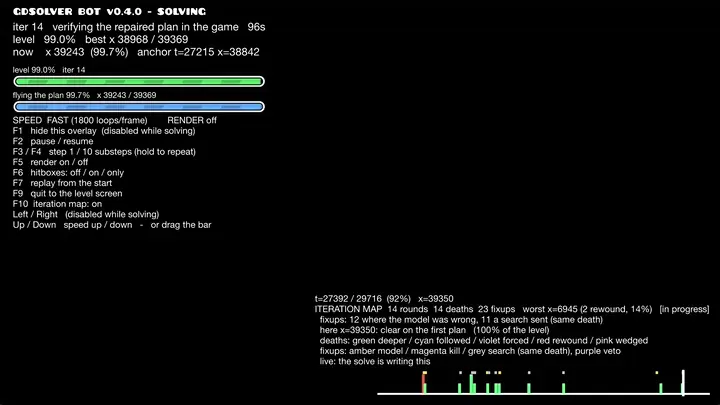
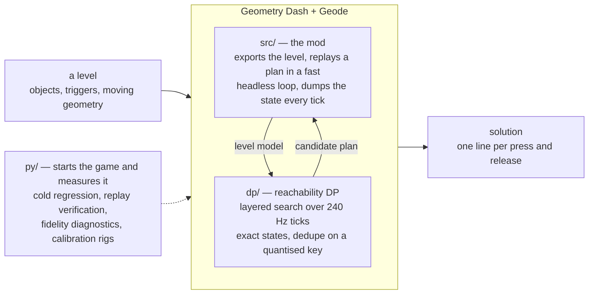
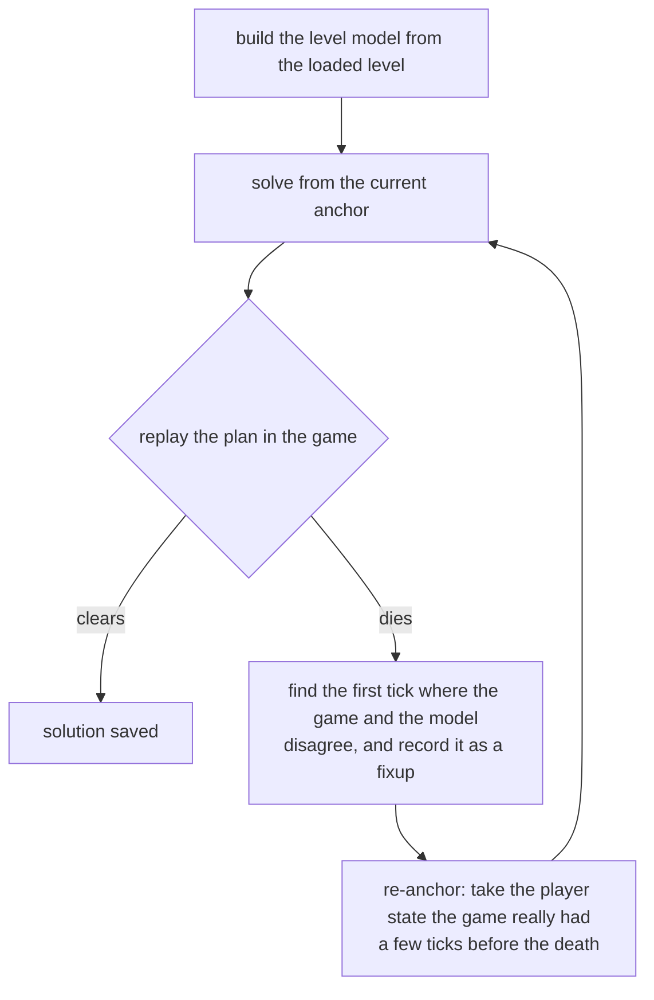

# gdsolver

**An automatic TAS solver for Geometry Dash** (2.2081, Windows / Steam). It
solves a level by playing it — inside the game, from cold.

**[Download `gdsolver.solver.geode`](https://github.com/gdsolver/gdsolver/releases/latest)**
from the latest release, drop it into Geometry Dash's `geode/mods/` folder and
start the game. [Geode](https://geode-sdk.org) has to be installed first; see
[Installing](#installing). An Android build comes separately, as an experimental
pre-release that is not supported ([docs/ANDROID.md](docs/ANDROID.md)).

<p align="center">
  
</p>

<p align="center"><sub>
  The last four seconds of solving <b>Bloodbath</b>, the first three of the
  replay, then ten of its wave part. The overlay is the loop's own: which round
  it is on, how far the best plan has reached, how far the search has got. The
  screen is dark because the search is running — the frames go to the fast loop
  instead — and it comes back when a candidate has actually cleared.
</sub></p>

## A few of the Extreme Demons it has solved

<p align="center">
  <a href="https://youtu.be/1ORlnG4zFfc"></a>
  <a href="https://youtu.be/lPco2GpVe2c"></a>
  <a href="https://youtu.be/b1taOeFYbY0"></a>
</p>

| Level | Uploaded by |
|---|---|
| Bloodbath | Riot |
| Antarctic Lights | declanlc |
| Amethyst | iMist |

These three were solved cold by the v0.4.0 build, the way any level is — its play
button, **Solve**, and nothing else: no seeds, no previous solution, no hints,
nothing but the level — for the end of the level (Antarctic Lights has three coins,
the other two none).

These are other people's levels, solved by a bot. A solution is a TAS, not a
completion: while the mod drives nothing is recorded, and its replays are marked as
bot input (see [Safety](#safety--community-notes)). They are also custom levels,
and unlike the official levels they are not guaranteed to solve: of 100 rated
levels drawn at random, 67 cleared, and of the 29 of those saved in 2.2, 11
([docs/CUSTOM_LEVELS.md](docs/CUSTOM_LEVELS.md)).

Give it a level and it looks for an input sequence that clears it. It does not
re-implement the game's physics: an approximate, measured-where-it-matters model
drives a **reachability DP** (which `(y, velocity)` states are reachable at every
physics tick), and the game itself — running inside a **Geode mod** — is the
verifier that decides whether a candidate plan really clears. Where the replay
diverges from the model, the solver re-anchors on the game's own state and
continues from there; where the model cannot get through a stretch at all, it
searches the game itself there.

**All 22 official levels, and the 17 levels of the spin-off games, are solved
cold** — no seeds, no previous solutions, no external ground truth — by the loop
inside the game, with nothing installed but Geometry Dash, Geode and this mod.
Press a level's play button, pick **Solve** in the menu that opens, and it builds
the level, searches, replays the candidate, and repairs the plan wherever the
game disagrees with it; no external process is involved. Most levels take under
a minute. The solutions of the 22 are tracked in [`data/`](data/) as
`solution_lv<N>_dp.txt`, one `input=<tick>,<0|1>` line per press or release.

**With every coin, too.** Switch **Coins** on in that menu and the goal becomes
the end of the level *and* every coin in it. The 22 official levels and the six
spin-off levels that have coins (Meltdown's three and SubZero's three) are solved
that way as well, cold, and each of those solutions replays to a clear with every
coin counted by the game itself; the 22 are tracked beside the others as
`solution_lv<N>_coins.txt`. Coins picked up while the mod drives are never
awarded (see [Safety](#safety--community-notes)) — a coin route is a TAS result,
not progress on a save file.

Those levels are also the supported set — see [What's next](#whats-next) for
where custom levels and platformer mode stand.

The per-level results — repairs and times for the 22 official levels and the 17
spin-off levels, with and without coins, and how they compare with v0.3.2 — are in
[docs/RESULTS.md](docs/RESULTS.md).

## How it works



Geometry Dash gives the player no steering input: the level sets the forward speed,
so the only decision per physics tick is *pressed or not*. Clearing a level is
then a reachability question over `(tick, y, vy, mode, gravity, size, ...)`, and
two properties make the game usable as the oracle for it: the physics are
deterministic under *click on steps*, and x is essentially a clock, so re-anchoring
the search on a later tick costs nothing. (*Essentially*, because stair snapping
leaves a sub-pixel phase and a rotation section turns the frame — see
[docs/ARCHITECTURE.md](docs/ARCHITECTURE.md#1-the-problem).) That is the whole loop:



A *fixup* is the model agreeing to be wrong: from then on, whenever it meets
that same state again it applies the game's result instead of its own. Dead
bands, touch triggers that must be entered, ladders of anchor depths and
phantom-death detection exist for the other cases where the model is blind.
Every run is cold, and a run's fixups live only in that run.

How far each solve looks ahead follows the game's last verdict: while replays keep
dying soon after their anchor, the loop plans 3,000 ticks at a time and lets the
game check each step; once a plan outlives its step, it plans the rest of the
level. And a repair does not have to solve everything past the death again: when
the new search comes back onto the trajectory of the plan that died, it stops
there and keeps that plan's inputs from that point on.

Around that loop:

* **Section solving.** Where the repairs are not getting the plan across a wall,
  the loop replays to a practice checkpoint before it, searches the game itself
  from there, and splices back what the game reproduces —
  [docs/SECTION_SOLVE.md](docs/SECTION_SOLVE.md).
* **Coins.** With coins on, the collected set is part of the search state and a
  state that leaves a coin behind is dead; nothing steers the search towards a
  coin, the goal simply is not reached without it. Coins that wait for an item
  counter, a key or a switch are routed through what turns them on —
  [docs/COINS.md](docs/COINS.md).
* **Heavy levels** are solved on a copy without the objects the run cannot depend
  on, and every plan is verified on the level itself before it is filed —
  [docs/LEVEL_SLICE.md](docs/LEVEL_SLICE.md).
* **Moving geometry** is the game's own recording of each replay, joined at the
  tick the last replay died to a recording of the level played with no input.
  Some of it the game draws from random seeds (an Area Move's distance, Random
  triggers). While the bot drives, the seeds are set to the same values before
  every attempt, so every attempt meets the same draw; the model still treats the
  whole box an Area Move can land in as deadly while the object is solid, so its
  plans do not depend on the draw (Area Rotate and Area Scale with a variance, and
  an Advanced Follow's, are not covered yet; the `areaenv:` line counts them).

* **`dp/`** — the solver core (`leveldp`, also linked into the mod). States are
  *exact*; the per-layer hash only deduplicates and never snaps a state, so every
  surviving path is a replayable plan. The DP is a candidate generator — the
  proof is always a plain replay in the game. Its physics rules are measured
  against the game (calibration levels, traces, disassembly), not fitted.
* **`src/`** — the Geode mod: level export, input injection, the per-tick state
  dump, moving-geometry recording, the fast headless loop, and the repair loop
  itself (`src/mod/repair.hpp`). It also blocks achievements and statistics
  while it is driving.
* **`py/`** — development tools; nothing here solves. The cold regression over
  all levels (`cold_regress.py`) and the manifest that says what a run measured
  (`cold_manifest.py`), replay verification, fidelity diagnostics,
  calibration-level generation and tests, and an MCP server for probing the
  running game.

[`docs/ARCHITECTURE.md`](docs/ARCHITECTURE.md) has the long version.

## What's next

**Custom levels — most older ones solve; the newest gimmicks often do not yet.**
Nothing in the loop is specific to the official levels, and any level can be
picked. On the release build, 100 rated levels drawn at random, and 200 more
drawn only from levels saved in 1.8 or earlier, were each given up to 20 minutes.
Of the 100, 67 cleared cold. Levels built only from parts that existed before 2.0
mostly solve as they are — 206 of the 215 across both draws that use nothing from
2.0 on, and the model disagreed with the game about a fifth as often per tick on
them as on the rest. Levels that lean on the 2.1 and 2.2 gimmicks often do not
solve yet: of the levels saved in those versions, 35 of 49 and 11 of 29 cleared.
The regression covers the official levels only, so a custom level's result is
outside what it keeps honest. The play menu says so up front: a yellow line on a
custom level that uses objects from 2.0 on, and a red one when a level holds
something the model cannot express at all.
[docs/CUSTOM_LEVELS.md](docs/CUSTOM_LEVELS.md) has the breakdown, which gimmicks
the model does not cover, and what a failure looks like. The rule stays to clear
what the game lets the loop clear: where the model has no answer, the section
solver searches the game itself, and a plan the game clears is a solution however
it was found.

The work on custom levels:

* **Model divergences** — the rules that disagree with what the game measures are
  fixed one at a time; this never stops.
* **The search's logic** — plans that die where the model is right; most of the
  official levels' repairs are of this kind ([docs/RESULTS.md](docs/RESULTS.md)).
  Also continuous.
* **Custom levels in the regression**, so that a change is measured on them too.
* **Heavy levels** — the speed of levels with very many objects.

**The next milestone: the search as a plug-in.** Today the reachability DP and
the physics model are written together. The plan is to separate them, so that the
search can be swapped without touching the physics and new searches can be tried
side by side — one search tuned for every level may not exist. The search is also
the part that needs no knowledge of Geometry Dash's physics, so it is where
contributions are most welcome.

**Platformer levels are outside the formulation, not merely unmeasured.** The
search rests on there being no steering input; a platformer level hands the player
one, so forward position stops being driven by the level and the decision each
tick stops being one bit. No measurement closes that — it is a different search
problem, and the section solver, which also chooses one bit per tick, cannot
search it either. So the mod refuses one instead of trying: it reads both the
layer's flag and the level's own, and takes the refusal if the two ever disagree.
Safety is unaffected either way — the record gate asks whether an automated session is open, never which
mode is running.

## Installing

Grab **[`gdsolver.solver.geode` from the latest release](https://github.com/gdsolver/gdsolver/releases/latest)**
and drop it into Geometry Dash's `geode/mods/` folder, then start the game — the
usual place is

```
C:\Program Files (x86)\Steam\steamapps\common\Geometry Dash\geode\mods\
```

Geode itself has to be installed first ([geode-sdk.org](https://geode-sdk.org)).
The build is for **Windows and GD 2.2081**; Geode refuses to load it on anything
else rather than misbehaving. Nothing else is needed — no Python, no external
process, no second copy of the game.

**Android** (android64, GD 2.2081): an Android build is published on the releases
page as a separate pre-release, as an experiment. It is not supported: the model's physics is Windows GD's, and
whether Android GD behaves the same has not been measured, so a result reached on
Android is Android's alone. [docs/ANDROID.md](docs/ANDROID.md) says how the port
differs.

The mod announces itself in the log the moment it loads, and says what it
suppresses:

```
gdsolver: loaded. While the bot drives -- solving or replaying -- achievements,
statistics, coins and the level's own record are all blocked. Your own attempts,
with the bot idle, record as usual.
```

Installing it does **not** cost you your progress: the block is tied to an
automated session being open, not to the mod being present. See
[Safety](#safety--community-notes).

## Building

Requirements: Visual Studio 2022 (C++ desktop workload), CMake ≥ 3.21, the
[Geode SDK](https://geode-sdk.org) (`GEODE_SDK` environment variable) and
Geode CLI for the mod.

```powershell
# solver CLI only (no Geode needed)
cmake -S . -B build-dp -DGDSOLVER_BUILD_MOD=OFF
cmake --build build-dp --config Release        # -> build-dp/dp/Release/leveldp.exe

# mod + CLI
geode build                                    # -> build/gdsolver.solver.geode
```

## Watching a run

A level's play button opens a menu offering three modes: **Normal**, **Replay** (play a stored
solution) and **Solve** (solve the level in-process), and a **Coins** switch: with it on, Solve
routes through every coin and files the result as `solution_lv<N>_coins.txt`, and Replay plays
that file and reports the coins the game counted.
A solve runs
fast, dark and silent until a candidate clears, and then plays that one through at 1x with the
artwork and the music. While a level is on screen an overlay reports what the loop is doing, and
F10 draws the iteration map: where the repair rounds went, and where the model — rather than
the plan — was wrong. Leaving a level ends its solve.

The overlay has no key that lets a player do what the game does not allow: no warp, no noclip,
no forced mode, no infinite jump. It is for watching a run, not for changing one.

[docs/RUNNING.md](docs/RUNNING.md) has the play menu, the overlay, the full key table and the seek
bar; [docs/ITERMAP.md](docs/ITERMAP.md) has what the map's marks mean.

## Safety / community notes

This is a TAS and research tool, not a way to fake records.

* **While the mod is driving — solving or replaying — nothing is recorded**:
  achievements, statistics and coins are blocked, and so is the level's own
  record (completion percentage, normal/practice best, attempts, jumps, orbs,
  diamonds, the secret key, coin achievements). GD's own "do not record" path
  is used for the block — the flag it sets when a level is played from a start
  position — and the counters GD advances outside that path (the level's
  attempt and jump counts) are put back afterwards.
* **Playing it yourself records normally.** The suppression is tied to an
  automated session being open, not to the mod being installed, so with the mod
  loaded but idle your own attempts, progress and achievements count as usual.
* Every session ends with the evidence in its log: how many recordings were
  blocked, and a `level record changed:` line that names any field that moved.
  It should read `none`.
* Replays driven by the mod are marked as bot input.
* The level-data dumps of the official levels that the development workflow
  uses are not part of this repository; the mod regenerates them from your own
  copy of the game.

## License

MIT — see [LICENSE](LICENSE).
