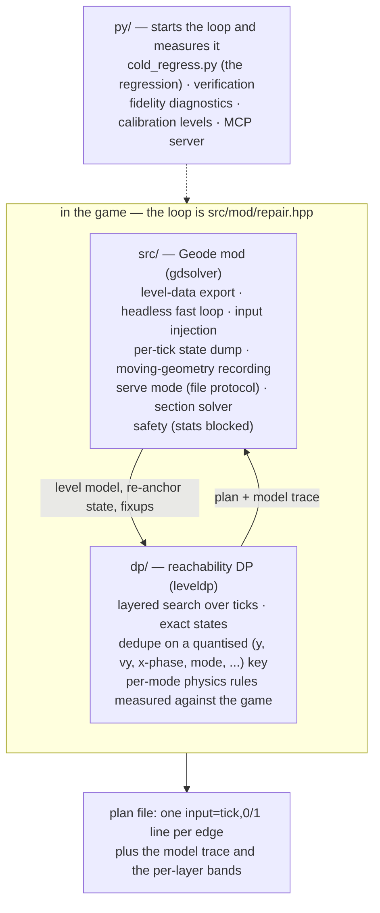
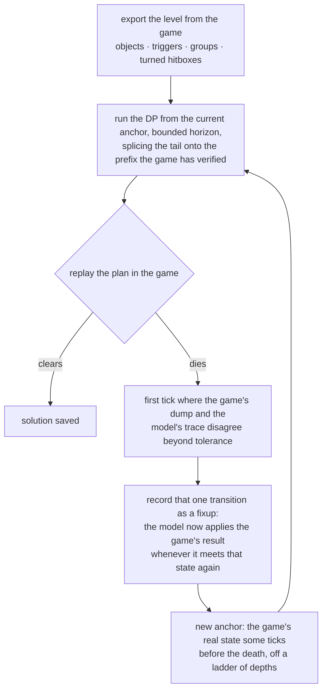

# Architecture

This document describes how gdsolver finds an input plan for a level and which
component owns which part of the job. The loop runs in-process — Geometry Dash,
Geode and the mod, nothing else — which is what §4 is about.

## 1. The problem

Geometry Dash gives the player no steering input: the level sets the forward
speed (speed portals included), so the only decision per physics tick
(240 Hz) is *pressed or not*. The state that matters is
`(tick, y, y-velocity, mode, gravity, size, ...)`, and clearing a level is a
reachability question: is there a sequence of presses under which the player
is alive at the end?

Forward position is *nearly* the clock rather than exactly it, and both exceptions
are visible in the search key. GD's stair snapping leaves a sub-pixel phase —
landings differ by 0.3 to 1.0 px, and one of those decides whether the next landing
falls on tick n or n+1 — so `xAbs` is keyed at a quarter pixel (`search_key.hpp`,
measured on lv11 x=24,863, where the only route lands at 24863.4 and jumps on the
very next tick). And a 2.2 rotation section turns the whole gameplay frame, so
world x can freeze for a stretch while the frame's own forward axis keeps advancing
— lv22's reference trace at t=16,995..17,005 holds x at 20085.0996 while y climbs
1.95 a tick under `gframe=3` (`frames.hpp`); the model holds its state in the
current frame's coordinates so that every rule stays written as "x is the clock,
y is height". Neither exception
hands the player an axis to steer with, and that — not "x is the tick" — is the
property the formulation rests on. A platformer level does hand one over, which is
why those are out of scope rather than merely unmeasured.

Two facts make the game a usable oracle for that question:

* **Determinism** — with input precision set to *click on steps*, the same input
  sequence yields the same trace, independent of frame rate. This is measured, not
  assumed; everything below rests on it. It holds for fixed settings, and one
  graphics setting is not neutral: the resolution option changes the hit radius
  the game gives saws (lv20's id 187 is 21.87 at resolution index 25 and 21.96 at
  index 8), which is enough to change a cold run's first plan. So traces, plans and
  baselines compare only at one resolution: the results here are measured at
  index 25, and the cold regression records the index and refuses to compare
  across it.
* **x is essentially a clock** — re-anchoring the search on a later tick costs nothing in
  terms of path choice, so a plan can be verified in the game and repaired
  from the first point of disagreement.

## 2. Components

One round trip per iteration: the mod hands the solver the level and, after a
replay that died, the game's own state to restart from; the solver hands back a
plan and the model trace the next divergence is measured against.

### 2.1 `dp/` — the solver core

* `dp/src/dp/*.hpp` is one translation unit split into modules in dependency
  order, each header including the previous one: the speed tables and per-mode
  constants, then geometry (hitboxes, OBB/SAT tests, rotated gameplay frames),
  then the world (moving geometry, triggers, level loading), then `step` — the
  per-tick physics step — with `fixup` and `cli` on top. `dp/src/leveldp_main.cpp`
  is a three-line `main` around `dp::cliMain`, and the mod calls that same
  function in-process: the CLI and the mod run one solver, not two.
* The level comes in as an objrects CSV through `loadLevelFrom(std::istream&)`.
  Setting `dp::g_levelCsv` makes it read a buffer instead of a file, which is
  how the mod solves a level it never wrote to disk.
* States are **exact** (double y / vy plus discrete flags). The per-layer hash
  only deduplicates; it never snaps a state, so every surviving path is a
  replayable plan. The DP is a candidate generator; the proof is always a plain
  replay in the game.
* A cell keeps **two** representatives, the highest and the lowest `vy` in it.
  First-wins was tried and kept the slowest lineage in every cell, which
  strangled climbs (a ship's climb rate collapsed to ~0.02 vy/tick); keeping one
  extreme instead discarded the dive-recovery lineages. Both extremes is what
  survives both.
* When several states reach the goal, the plan emitted is the one whose **route
  kept the most room**, not the one that happened to be enumerated first. Each
  state carries `tight`: how many ticks its lineage spent with less vertical
  clearance than the model's own error. It is carried rather than recomputed —
  clearance at the goal itself says nothing, because every state that gets there
  is in open sky — and it is deliberately *not* part of the dedupe key, being a
  property of how a state was reached rather than of the state. Ties keep the
  incumbent, so a level where nothing is tight emits exactly what the old rule
  did.
* Output contracts: `SOLVED at ...`, `PARTIAL: frontier died at t=.. x=..`,
  `FAILED: ...` on stdout; files `<out>` (the plan, `input=<tick>,<0|1>` lines),
  `<out>.trace.csv` (per-tick model state) and `<out>.bands.txt` (per-layer
  frontier width).

### 2.2 `src/` — the Geode mod

* `src/mod/*.hpp` — the infrastructure, again a header chain: configuration
  (`autorun.cfg` keys), the trace/dump/result writers, hotkeys and the overlay,
  command polling, crash post-mortem, the stall watchdog, plan I/O and the
  session lifecycle.
* `src/mod/hooks_*.cpp` — one translation unit per hook group: system
  (achievement and statistic blocking, music, focus), menu, game layer (tick
  control, the fast loop, tracing), player (state dump) and play layer (attempt
  boundaries, checkpoints, death and completion).
* `src/solver/*.hpp` — level-data export, moving-geometry recording
  (grouptrace), the clearance table, the raw player snapshot, the section
  solver (§3.1), the coin prerequisites census (`route.hpp`) and the level
  slice (`slice.hpp`, with the session side in `src/mod/level_slice.hpp`).
* `src/mod/itermap.hpp` — what the repair loop's rounds cost, and where. Each
  round's death, each fixup and each veto is recorded as the loop makes it,
  filed as `itermap_lv<N>.txt` when the solve ends either way, and drawn back
  over the level — during a solve by default, in a replay when `F10` asks.
  Recording only: nothing in the loop
  reads it back. `py/itermap_from_log.py` rebuilds the same file from a run's
  log, so runs made before it existed are readable too. How to read what it
  draws: [ITERMAP.md](ITERMAP.md).
* Protocol, per data root: `autorun.cfg` (session config and plan),
  `plan_in.txt` / `cmd.txt` (the next plan, live commands), `result.txt`
  (session results, one line per event), `dump.csv` (per-tick player state),
  `grouptrace*.txt` (moving geometry), `itermap_lv<N>.txt` (the iteration map).
* `src/mod/dp_bridge.{hpp,cpp}` — the one translation unit that compiles the
  solver core inside the mod. It mentions neither Geode nor cocos; everything
  crosses the boundary as plain C++. `dpselftest=1` reports what the core made
  of the level, in the CLI's own words, so the two can be compared line for
  line.
* `src/mod/repair.hpp` — the solve loop itself (§3), in the game. cfg
  `dpsolve=1` builds the level from `PlayLayer`, solves it on a worker thread,
  replays the plan, and when the replay dies re-anchors on the player state it
  recorded tick by tick and solves the tail from there. The anchor record is
  read straight off `PlayerObject` as the replay runs, not parsed back out of
  `dump.csv` — being in-process is what makes that possible.
* Safety: while the mod is *driving* — solving or replaying — achievements,
  statistics, coins and the level's own record are all blocked; a human playing
  with the mod merely loaded records normally. The count of blocked events and
  a `level record changed:` line are printed at session end.

### 2.3 `py/` — tools

Nothing here solves. The loop lives in the mod; `py/` starts it and measures it.

* `cold_regress.py` — the cold regression: every level solved from nothing by
  the game's own loop, on a pool of isolated GD workers. Each run writes a
  manifest beside its logs (the commit, the package, every cfg value the mod
  held and the core's built-in defaults); `cold_manifest.py compare` refuses two
  runs that differ in anything but what was named, and `check` confirms a run
  against an expected set before it is blessed.
* `verify.py` / `verify_solutions.py` — replay every solution in the game;
  `quick_regress.py` — a fidelity regression that needs no worker at all;
  `fixcensus.py` / `fixfam.py` / `fidelity_diff.py` — where and why the model
  and the game disagree; `mklevel.py` + `calib_units.py` — calibration levels
  that measure one physics rule across all modes, and `test_*_rig.py` pinning
  particular rules against the game's own rows; `gdtas/` — worker
  provisioning, control and the shared readers; `mcp/` — an MCP server exposing
  the same protocol for interactive probing.

## 3. The solve loop (one level)

The first pass runs from tick 0; every later one starts at an anchor and splices
onto the prefix the game has already verified. What the diagram leaves out are the
mechanisms for the cases where the model is *blind* rather than merely inaccurate:
dead bands, touch triggers that must be entered, a ladder of anchor depths,
phantom-death detection, and — where none of that gets the plan across a wall —
the section solver of §3.1, which searches the game itself there. All of those
the loop drives itself.

Two things decide how much each repair costs. **The plan length** (cfg
`dpstephorizon`): a replay the game ends within one step
(3,000 ticks) of its anchor says the model is wrong there, so the next solve plans
one step and lets the game check it; a replay that outlives its step, or a wall the
run stops at twice, gets a plan to the end of the level. **The rejoin** (always on;
dp's `--rejoinwatch` / `--rejoinuse`): the model's
trace of the plan that died is handed to the next search, and when a state that did
not pass through the death comes back onto that trace (same y, velocity, mode,
gravity and frame), the search stops there and the plan carries on with the old
plan's inputs. The game still flies all of it; the rejoin only skips solving again
what the search would have re-derived. On the 22-level suite in one session the
suite went from 30 minutes (v0.1.4) to 19; the rejoin alone took it from 1,437 s to
1,120 s.

Every run is *cold*: no seeds, no previous solutions, no external inputs. The
fixups of a run live only in that run.

### 3.1 The section solver

A fixup is local: it applies where the model meets that exact state again, and
nowhere else. On a stretch the model is simply wrong about, the loop can grind —
every death teaches one fixup and the next plan dies a few ticks further on. When
the work spent at a wall reaches what a section solve would cost, or the ladder
runs out of anchors, the loop drops the model for that stretch: it replays its
deepest verified plan to a practice-mode checkpoint before the wall and searches
**the game itself** from there, breadth-first over the two inputs, the same shape
as the DP. A leaf that reaches the goal is replayed plainly from the checkpoint,
and only one the replay reproduces is spliced into the plan, which the game then
flies from the start of the level like any other. That is affordable because a
section makes the question narrow: the entry is fixed, the exit is binary and the
horizon is a few hundred ticks, so there is no fitness function to choose.

[SECTION_SOLVE.md](SECTION_SOLVE.md) has when a rung starts and where its window
goes, the handoff, the search, the splice and its pin, what it costs and the kind
of death it cannot see.

### 3.2 Coins and heavy levels

With coins on, the collected set is part of the search state, and the loop can
also work out what a coin needs to have happened first — a key, a touch box, a
switch — and route through it (cfg `routeprereq`, off by default):
[COINS.md](COINS.md).

A level with at least 10,000 objects its run cannot depend on is solved on a copy
without them, and every plan that clears the copy is verified on the level itself
before anything is filed; a wrong cut costs rounds, never a wrong answer:
[LEVEL_SLICE.md](LEVEL_SLICE.md).

## 4. Running inside the game

A user needs only Geometry Dash, Geode and `gdsolver.solver.geode`:

* **`dp/` is linked into the mod.** The level model is built in memory from the
  loaded `PlayLayer` by the same code that writes the text exports, and a solve
  in the game produces a plan byte-identical to the CLI's.
* **`src/mod/repair.hpp` holds the loop** — solve → replay → learn → re-anchor →
  splice → replay — in the game, with no external process. All 22 official levels
  and the 17 spin-off levels solve cold this way (`py/cold_regress.py`).

Acceptance for a change is behavioural identity where identity is claimed: the
CLI must produce byte-identical plans and traces on a fixed suite
(`py/quick_regress.py`), and the loop must reproduce the cold-run fingerprint —
iteration, plan hash, death tick and x, fixup hash. The loop prints those itself
(cfg `dpfingerprint`), and `py/cold_regress.py` compares those `[fp]` lines per
level against the baseline, which is adopted from a reviewed one-session run
(`--adopt`). The iteration count is reported with them but does not fail a run;
the wall clock is not deterministic and is never the criterion.

The two halves of that measure different things, and the section suite does not
predict the loop. It anchors on the game's real state every few hundred ticks
and asks how long the model tracks from there, so it sees physics and nothing
else. The loop's iteration count also carries which corridor the search walked,
and the search is deepest-first: one rule can close four sections and leave the
count untouched, or improve the physics and double it by sending the run down a
different route. Both have been measured on the same change. Read the section
suite as "did the physics move", never as "is this an improvement".

## 5. What the model covers

The DP's rules are measured one at a time against what the official levels
actually use — calibration rigs, traces out of the game, the disassembly. That
measuring is also the boundary of what is supported.

* **Custom levels** go through the same path: level selection is the game's own
  and the model is built from whatever `PlayLayer` loaded, so many of them solve
  as they are. Nothing keeps them honest, though. An object, a trigger or a mode
  the model has never met is a disagreement the loop can only discover by dying
  in a replay, and it repairs one disagreement per iteration — so an unmodelled
  level does not fail, it crawls, or clears where the section solver finds a way
  through the game itself. The corpus the boundary was measured on is
  almost entirely 1.x, so a level built from early-era parts has the better
  chance — but the predictor is the mechanics a level uses, not its date, and
  the two only correlate because mechanics arrived with versions. A supported
  subset has to be defined in objects and modes; a version is a first guess at
  which of them a level contains. What the surveys found, gimmick by gimmick:
  [CUSTOM_LEVELS.md](CUSTOM_LEVELS.md).
* **The objective is survival, or survival and every coin**: alive at the end of
  the level, and with the play menu's Coins switch (cfg `coinroute`, dp `--coins`)
  also every coin in it. With coins on, the collected set is part of the search
  state, a coin is collected when the player's own rect overlaps it where its
  group has put it, and a state that leaves an uncollected coin behind is dead;
  the search is not steered towards a coin, the goal is simply not reached
  without it. The loop ends a replay that passes a coin GD did not credit and
  repairs it from there. All 22 official levels clear with 3/3 that way, and so
  do the six spin-off levels that have coins; without coins, a plan that collects
  one of the official 66 did so by accident — 23 of them with the v0.3.0
  solutions, by the game's own count. Where the coins are is always exported, and `coinMode` turns on two witnesses
  that both work while every award is blocked: the mod's own pickup test (a
  distance from the coin's loaded position) and GD's own, hooked at
  `GJBaseGameLayer::pickupItem`, which is where `collisionCheckObjects` credits a
  coin. They are reported side by side (`coin:` / `coingd:` / `coincmp:`) because
  the first is a claim about the second, and comparing them is what says whether
  a route that plans to collect a coin would actually be paid for it. The
  measurement on the v0.3.0 solutions: the same verdict on 18 of the 23 coins
  GD credited on the coins-off ones and on 50 of 66 on the coin ones, never a
  pickup GD did not credit, and the rest real pickups it missed — see COIN_RADIUS in
  `src/solver/solver.hpp`.
  `itemcnt:` reports GD's item counters, which is what actually gates the coins
  that have to be made to appear (lv21's third and lv22's third). How each layer
  treats coins, and how the loop finds what a coin needs first:
  [COINS.md](COINS.md).
